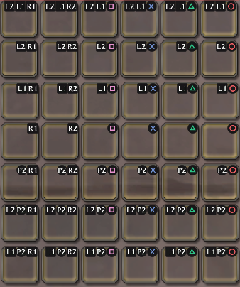
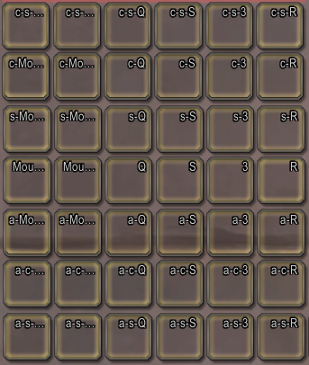
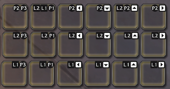
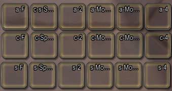

# Action Bar Layout

([back](../README.md))

---

## Main Bars I

Contains "Action Bar 1" (main bar, two total "pages"), "Action Bar 2",
"Action Bar 3" and the first half of "Action Bar 4".

Modifiers                    | PADRSHOULDER | PADRTRIGGER | PAD3        | PAD1        | PAD4        | PAD2
-----------------------------|--------------|-------------|-------------|-------------|-------------|-----
PADLTRIGGER + PADLSHOULDER   | `67`         | `68`        | `69`        | `70`        | `71`        | `72`
PADLTRIGGER                  | `61`         | `62`        | `63`        | `64`        | `65`        | `66`
PADLSHOULDER (`()` page 2)   | `7` (`19`)   | `8` (`20`)  | `9` (`21`)  | `10` (`22`) | `11` (`23`) | `12` (`24`)
(no modifiers) (`()` page 2) | `1` (`13`)   | `2` (`14`)  | `3` (`15`)  | `4` (`16`)  | `5` (`17`)  | `6` (`18`)
PADPADDLE2                   | `55`         | `56`        | `57`        | `58`        | `59`        | `60`
PADLTRIGGER + PADPADDLE2     | `49`         | `50`        | `51`        | `52`        | `53`        | `54`
PADLSHOULDER + PADPADDLE2    | `25`         | `26`        | `27`        | `28`        | `29`        | `30`

---

## Main Bars II

Contains "Action Bar 5" and the second half of "Action Bar 4".

### Paddles (left)

Modifiers    | PADPADDLE3 / F    | PADPADDLE1 / Space
-------------|-------------------|-------------------
(varies)     | `43` PADPADDLE2   | `44` PADLTRIGGER + PADLSHOULDER
PADLTRIGGER  | `37`              | `38`
PADLSHOULDER | `31`              | `32`

### D-Pad (right)

Modifiers    | PADDLEFT / 2 | PADDDOWN / Scroll Down | PADDUP / Scroll Up | PADDRIGHT / 4
-------------|--------------|------------------------|--------------------|--------------
PADPADDLE2   | `45`         | `46`                   | `47`               | `48`
PADLTRIGGER  | `39`         | `40`                   | `41`               | `42`
PADLSHOULDER | `33`         | `34`                   | `35`               | `36`

---

## Druid Form Bars

### Bear

Modifiers      | PADRSHOULDER | PADRTRIGGER | PAD3  | PAD1  | PAD4  | PAD2
---------------|--------------|-------------|-------|-------|-------|-----
PADLSHOULDER   | `103`        | `104`       | `105` | `106` | `107` | `108`
(no modifiers) | `97`         | `98`        | `99`  | `100` | `101` | `102`

### Cat

Modifiers      | PADRSHOULDER | PADRTRIGGER | PAD3 | PAD1 | PAD4 | PAD2
---------------|--------------|-------------|------|------|------|-----
PADLSHOULDER   | `79`         | `80`        | `81` | `82` | `83` | `84`
(no modifiers) | `73`         | `74`        | `75` | `76` | `77` | `78`

### Moonkin

Modifiers      | PADRSHOULDER | PADRTRIGGER | PAD3  | PAD1  | PAD4  | PAD2
---------------|--------------|-------------|-------|-------|-------|-----
PADLSHOULDER   | `115`        | `116`       | `117` | `118` | `119` | `120`
(no modifiers) | `109`        | `110`       | `111` | `112` | `113` | `114`

---

## Dragon Riding

Modifiers      | PADRSHOULDER | PADRTRIGGER | PAD3  | PAD1  | PAD4  | PAD2
---------------|--------------|-------------|-------|-------|-------|-----
PADLSHOULDER   | `127`        | `128`       | `129` | `130` | `131` | `132`
(no modifiers) | `121`        | `122`       | `123` | `124` | `125` | `126`

---
